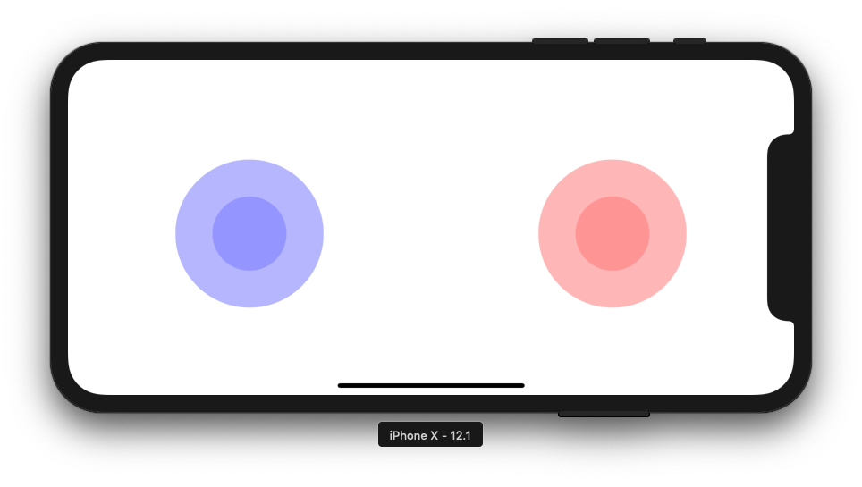

# React native game pad (ios + android)

A React Native game pad using [nipplejs](https://github.com/yoannmoinet/nipplejs) for an on-screen joystick

[](https://nodei.co/npm/react-native-game-pad/)

[](https://badge.fury.io/js/react-native-game-pad)

<p align="center">
	
</p>

<p align="center">
	
</p>

## Install

```
npm i react-native-game-pad -S
```

---

## Usage

The recent move of WebView to an external package has caused a breaking change. The new [webview](https://github.com/react-native-community/react-native-webview) now needs to be linked. To make this package work the `react-native-webview` package is now a peerDependency.

Please install [react-native-webview](https://github.com/react-native-community/react-native-webview) and follow the install instructions.

Import it into your project. If you want a dual joystick game pad set `dualJoystick={true}` (defaults to single joystick gamepad).
The methods for dual joystick events are different. Please refer to the list of props below.

```
import RNGamePad from 'react-native-game-pad';
```

## Options

```javascript
var options = {
  color: String,
  size: Integer
};
```

## Prop

```javascript
<RNGamePad
  onStart={this.handleOnStart}
  onEnd={this.handleOnEnd}
  onMove={this.handleOnMove}
  onDir={this.handleOnDir}
  onDirUp={this.handleOnDirUp}
  onDirDown={this.handleOnDirDown}
  onDirLeft={this.handleOnDirLeft}
  onDirRight={this.handleOnDirRight}
  onPlane={this.handleOnPlane}
  onPlaneUp={this.handleOnPlaneUp}
  onPlaneDown={this.handleOnPlaneDown}
  onPlaneLeft={this.handleOnPlaneLeft}
  onPlaneRight={this.handleOnPlaneRight}
  onLeftStart={this.handleLeftOnStart} // methods for handling dual joysticks START
  onLeftEnd={this.handleLeftOnEnd}
  onLeftMove={this.handleLeftOnMove}
  onLeftDir={this.handleLeftOnDir}
  onLeftDirUp={this.handleLeftOnDirUp}
  onLeftDirDown={this.handleLeftOnDirDown}
  onLeftDirLeft={this.handleLeftOnDirLeft}
  onLeftDirRight={this.handleLeftOnDirRight}
  onLeftPlane={this.handleLeftOnPlane}
  onLeftPlaneUp={this.handleLeftOnPlaneUp}
  onLeftPlaneDown={this.handleLeftOnPlaneDown}
  onLeftPlaneLeft={this.handleLeftOnPlaneLeft}
  onLeftPlaneRight={this.handleLeftOnPlaneRight}
  onRightStart={this.handleRightOnStart}
  onRightEnd={this.handleRightOnEnd}
  onRightMove={this.handleRightOnMove}
  onRightDir={this.handleRightOnDir}
  onRightDirUp={this.handleRightOnDirUp}
  onRightDirDown={this.handleRightOnDirDown}
  onRightDirLeft={this.handleRightOnDirLeft}
  onRightDirRight={this.handleRightOnDirRight}
  onRightPlane={this.handleRightOnPlane}
  onRightPlaneUp={this.handleRightOnPlaneUp}
  onRightPlaneDown={this.handleRightOnPlaneDown}
  onRightPlaneLeft={this.handleRightOnPlaneLeft}
  onRightPlaneRight={this.handleRightOnPlaneRight}
  onButtonAPress={this.handleButtonAPress}
  onButtonAPress={this.handleButtonAPress}
  buttonAColor='red'
  onButtonBPress={this.handleButtonBPress}
  buttonBColor='green'
  dualJoystick={true}
  options={{
    size: 400,
    color: "blue",
    lockX: true
  }}
  options2={{
    size: 400,
    color: "red",
    lockY: true
  }}
/>
```

## Events

_The following events section has been lifted from the nipplejs repo and altered for this library as they return the same data._

#### `onStart`

A joystick is activated. (the user pressed on the active zone)

Will pass the instance alongside the event.

#### `onEnd`

A joystick is de-activated. (the user released the active zone)

Will pass the instance alongside the event.

#### `onMove`

A joystick is moved.

Comes with data :

```javascript
{
    identifier: 0,              // the identifier of the touch/mouse that triggered it
    position: {                 // absolute position of the center in pixels
        x: 125,
        y: 95
    },
    force: 0.2,                 // strength in %
    distance: 25.4,             // distance from center in pixels
    pressure: 0.1,              // the pressure applied by the touch
    angle: {
        radian: 1.5707963268,   // angle in radian
        degree: 90
    },
    instance: Nipple            // the nipple instance that triggered the event
}
```

#### `onDir`

When a direction is reached after the threshold.

Direction are split with a 45° angle.

```javascript
//     \  UP /
//      \   /
// LEFT       RIGHT
//      /   \
//     /DOWN \
```

You can also listen to specific direction like :

- `onDirUp`
- `onDirDown`
- `onDirLeft`
- `onDirRight`

In this configuration only one direction is triggered at a time.

#### `onPlane`

When a plain direction is reached after the threshold.

Plain directions are split with a 90° angle.

```javascript
//       UP               |
//     ------        LEFT | RIGHT
//      DOWN              |
```

You can also listen to specific plain direction like :

- `onPlaneUp`
- `onPlaneDown`
- `onPlaneLeft`
- `onPlaneRight`

## TODO:

- [x] allow different pad layouts
- [ ] Allow different types of joystick. Currently on `static` is supported
- [ ] Break example in to multiple screens
- [ ] Add test suite
- [x] Add X and Y locks

## License

react-native-game-pad is available under the MIT license. See the LICENSE file for more info.
